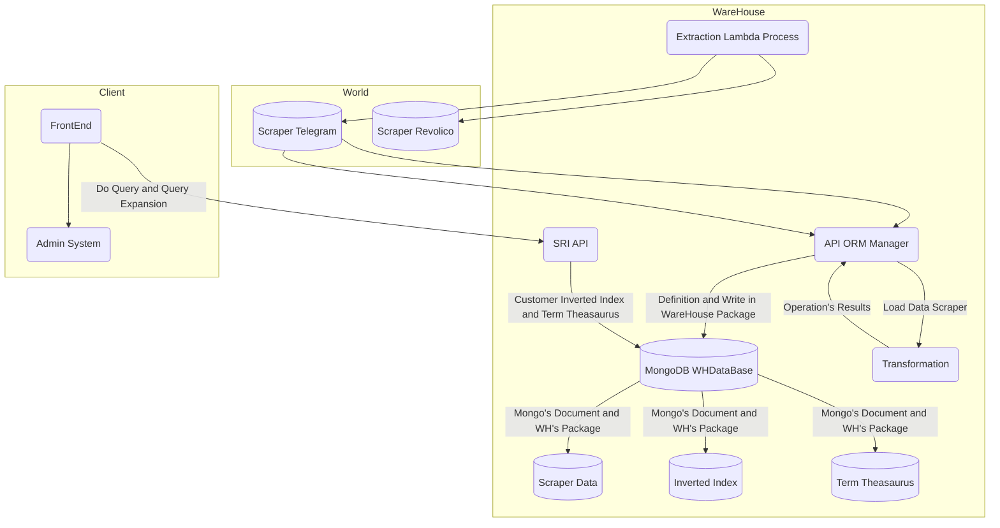

# dime-cosas

```mermaid
flowchart TB

    subgraph World 
    id1[(Scraper Telegram)]
    id2[(Scraper Revolico)]

    end

    
    subgraph WareHouse 
    id3(Extraction Lambda Process) --> id1
    id3(Extraction Lambda Process) --> id2
     
    id4[(MongoDB WHDataBase)] --> |Mongo's Document and WH's Package| id7[(Scraper Data )]
    id4[(MongoDB WHDataBase)] --> |Mongo's Document and WH's Package| id8[(Inverted Index)]
    id4[(MongoDB WHDataBase)] --> |Mongo's Document and WH's Package| id9[(Term Theasaurus)]
    
  
    id6(Transformation) --> |Operation's Results| id5(API ORM Manager)
    id5(API ORM Manager) --> |Load Data Scraper| id6(Transformation)
    id1[(Scraper Telegram)] -->   id5(API ORM Manager)
    id1[(Scraper Telegram)] -->   id5(API ORM Manager)
    id5(API ORM Manager) --> |Definition and Write in WareHouse Package| id4[(MongoDB WHDataBase)] 
    
    id10(SRI API) --> |Customer Inverted Index and Term Theasaurus| id4[(MongoDB WHDataBase)] 
    end
 
     
    subgraph Client 
    id11(FrontEnd) --> |Do Query and Query Expansion| id10(SRI API)
    id11(FrontEnd) --> id12(Admin System)
    end


```
