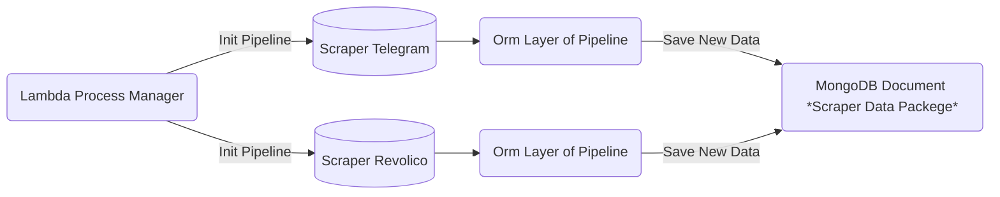
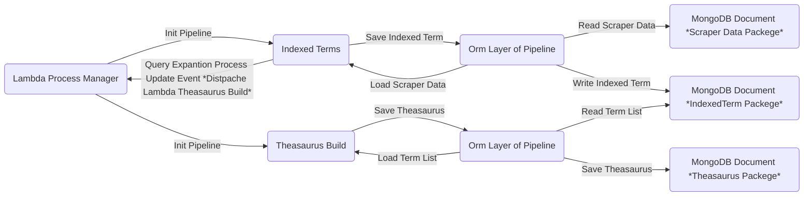

# dime-cosas

Warehouse Extraction Process




Warehouse Transformation Process



Warehouse Load Process

```mermaid
flowchart LR
    id1(Client) --> |Query| id2(Theasaurus Query Expantion)
  
    id2(Theasaurus Query Expantion) --> id3(Orm Layer of Pipeline)
        
    id3(Orm Layer of Pipeline) --> id4(MongoDB Document *Theasaurus Packege*)
        
    id2(Theasaurus Query Expantion) --> |New Query| id5(Probabilistic Model)
    id5(Probabilistic Model) --> id6(Orm Layer of Pipeline)
        
    id6(Orm Layer of Pipeline) --> id7(MongoDB Document *IndexedTerm Packege*)
    id5(Probabilistic Model) --> |Ranking| id1(Client)
 
